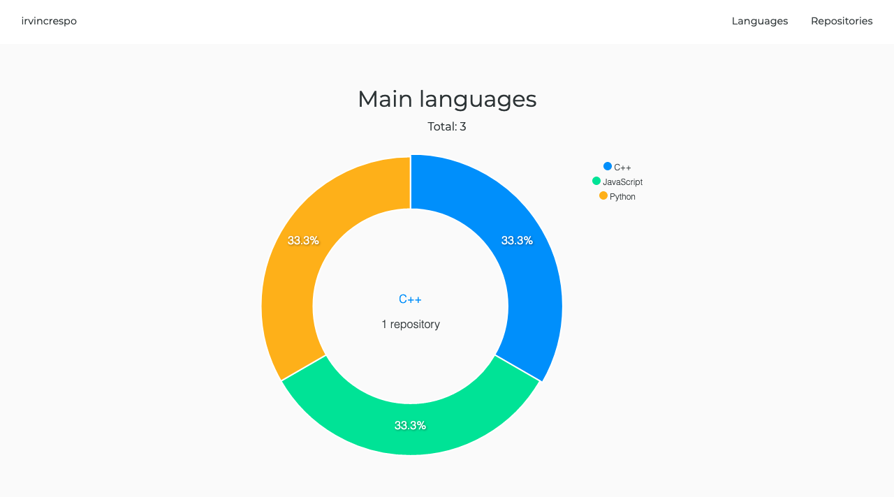

# [Github portfolio generator](http://isradeleon.com/github-portfolio.html)

Simple github portfolio generator, just provide your github username! Get a chart with the main languages within your repositories and your total number of stars:

[Generate a github portfolio](http://isradeleon.com/github-portfolio.html)

## Contribute

Pull requests are welcome if you want to add something to this portfolio generator!

## License

This code is licensed under `MIT license`. View [license](LICENSE).
